```{r setup, include=FALSE}
knitr::opts_chunk$set(echo = TRUE)
```

# Introduction
TarMet is a shiny application for targeted metabolic analyses based on mass spectrometry. TarMet can detect all of the isotopologues of target metabolites, and quantify the metabolites based on the peak areas automatically and efficiently, and it process isotope tracer assay well.

# File preparation
TarMet read raw LC-MS datasets with *mzR* package. The format can be one of *mzML*, *mzXML*, *mzData* or *CDF*. Otherwise, the files should be converted by [ProteoWizard](http://proteowizard.sourceforge.net/). 

# Isotopologues and Quantitative Analysis
## Definition
[MM48 dataset](https://www.ebi.ac.uk/metabolights/MTBLS188) is used here for an example. First, please click *Browse* button and upload all of the files to be analyzed. Wait for a minute, then select a sample as reference, which will be used for isotopologues analysis.
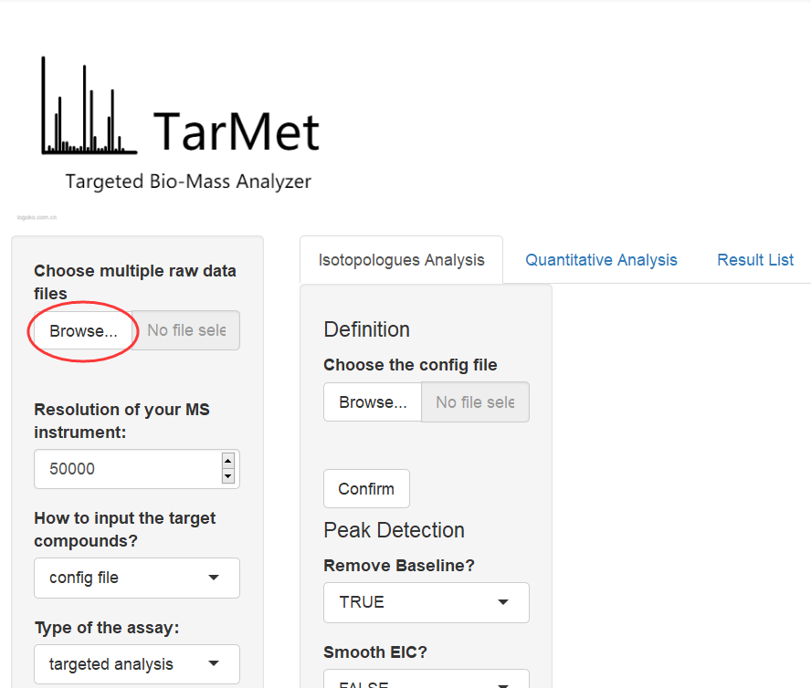

Then, you should input some parameters about your instrument and assay. Besides, please also input the target metabolite via the formula, and input which kinds of adduct of the metabolite to be detected, Usually *M+H*, *M+Na* and *M+K* are common in positive mode, while *M-H* and *M+Cl* are common in negative mode. You should also give the threshold of relative abundance, and only peaks above the threshold are under consideration. The isotope pattern will be calculated automatically based on the resolution of your MS.
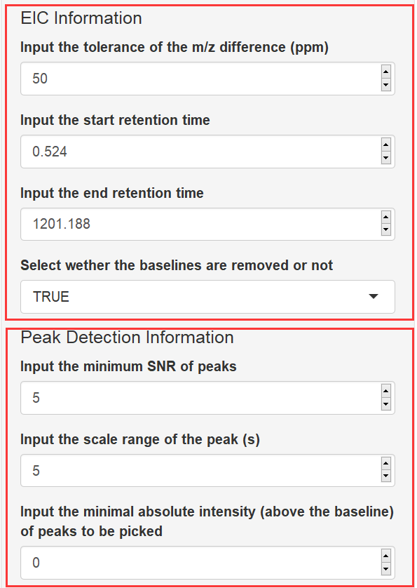

Last, you should choose/input the formula of the targeted compounds, and adjust the parameters explained as following sections and click *Confirm* button.
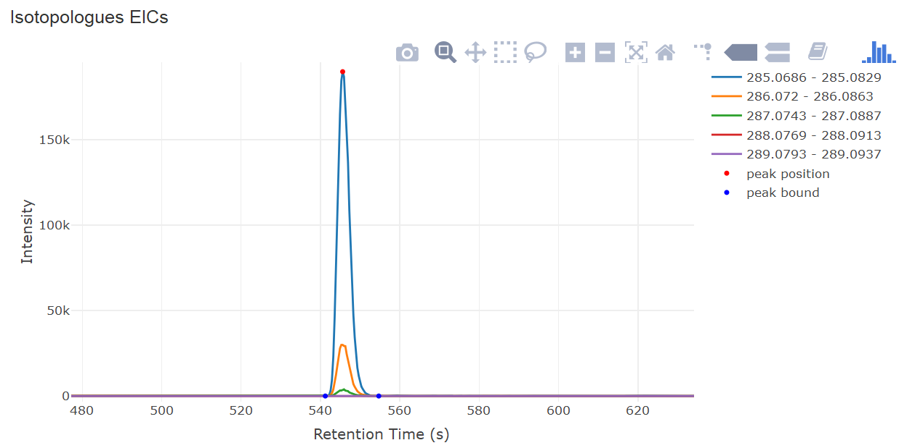

## EIC extraction and peak detection
The extraction ion chromatograms are obtained by sum the data points within a specific m/z tolerance, which is also calculated by the resolution. For calculating the peak areas accurately, the baseline can be removed by *airPLS* method.
The peak detection is based on *MassSpecWavelet package*. Three parameters should be given, which are the *minimum snrs*, *minimum scales* of peaks and *minimum intensities* of peaks. Besides, the peak bound of each peak will also be calculated, which is used for calculated the peak area. 
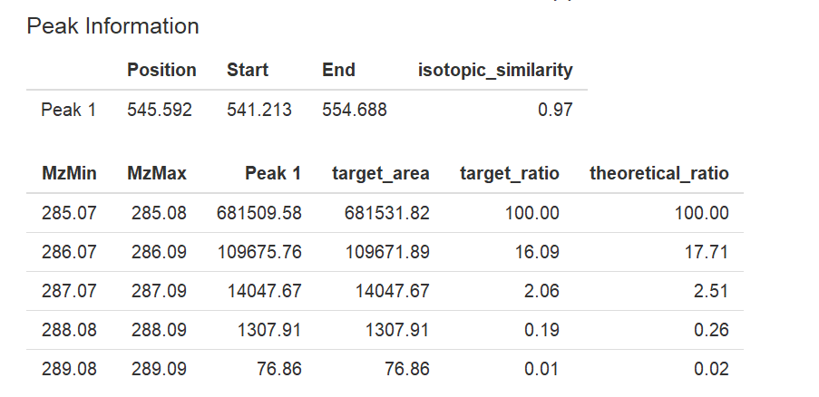


## Results of isotopologues analysis
First, the EICs of all of the isotopologues will be shown in the main panel after you click the *Confirm* button. The peak position and bounds will also be shown like the figure below.

The information of the peaks will also be shown below the EIC plot, which including the exact value of peak position and the bounds, the m/z values of isotopologues, and the peak areas. The theoretical isotopic pattern, real relative ratio of isotopologues and their similarity will also be given. If more than one peak is detected, this can be used for assist the user confirm which peak is belonging to the target metabolite. 
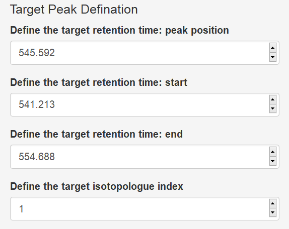

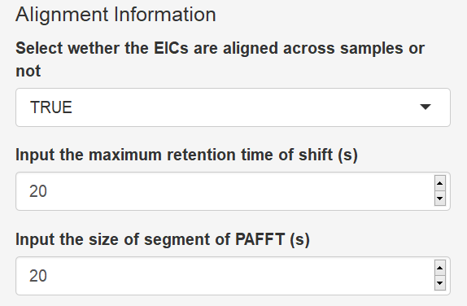

## Alignment
Usually, retention time of the same metabolite may differs between different samples. You can choose whether to correct the time shift. If you choose to align the samples, you should also give the maximum tolerence time shifts. The parameters used for alignment including: 
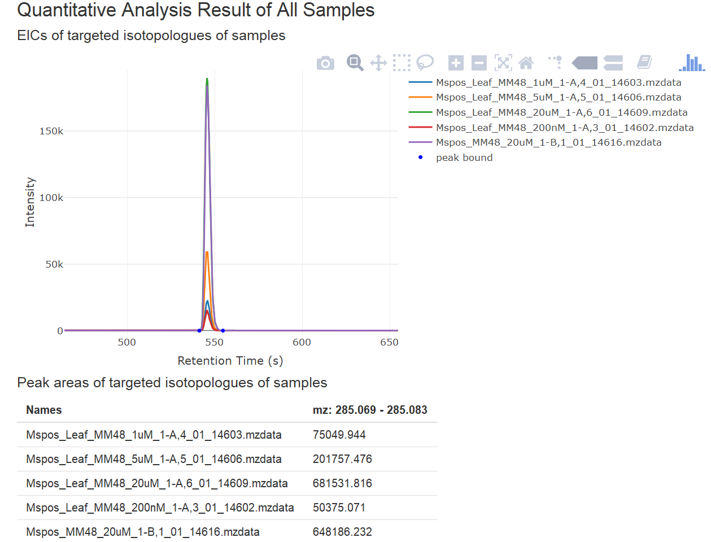

## Results of quantitative analysis
The quantitative results will be shown in the main panel below the result of isotopologues analysis, including the EICs of all samples of the chosen isotopologue of the targeted metabolite, and the peak areas of the peaks. 
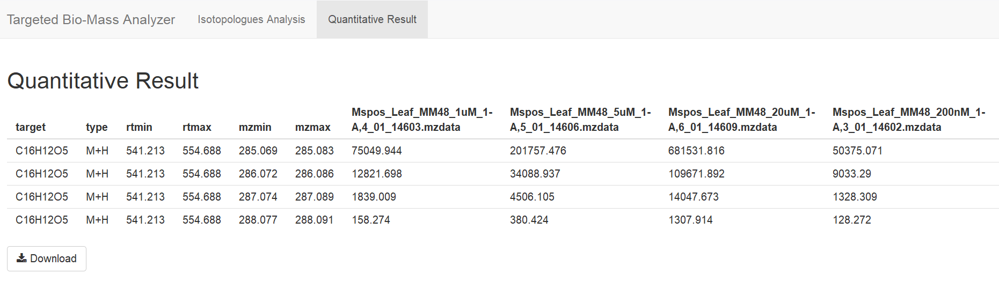

## Save the results
Once the results are obtained, you can click the *Download* button at the bottom and save the results of isotopologues analysis into a *csv* file. You can also click the *Add to list* button, and add the quantitative result to a list.Then you can input another targeted metabolite and repeat the formal steps. You can glance over and save the quantitative results at the *quantitative result* page. 
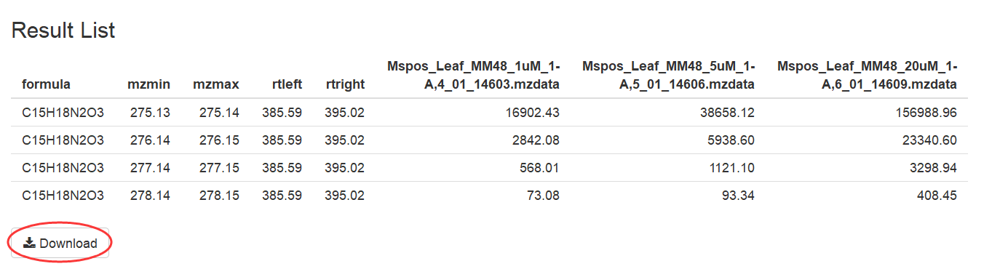


# Isotopic Tracer Analysis
## Definition
[Cellular metabolites dataset](https://gitlab.com/jimiwills/assay.R/) is used for an example. In the dataset the glucose and the related metabolites were traced by 13C. So, we input the maximum 13C number as 6, and the other stable isotopic atom as 0. We first input the m/z value of *M-H* adduct of glucose, which is 179.0561.

## EIC extraction and peak detection
This part is the same as the *Isotopologues and Quantitative Analysis*

## Results of isotopologues analysis
Multi peaks are detected from the extracted EICs. The one is with the maximum intensity of *M+6* trace, and the other one is with the maximum intensity with *M+0* trace. Obviously, the first one is our want. 
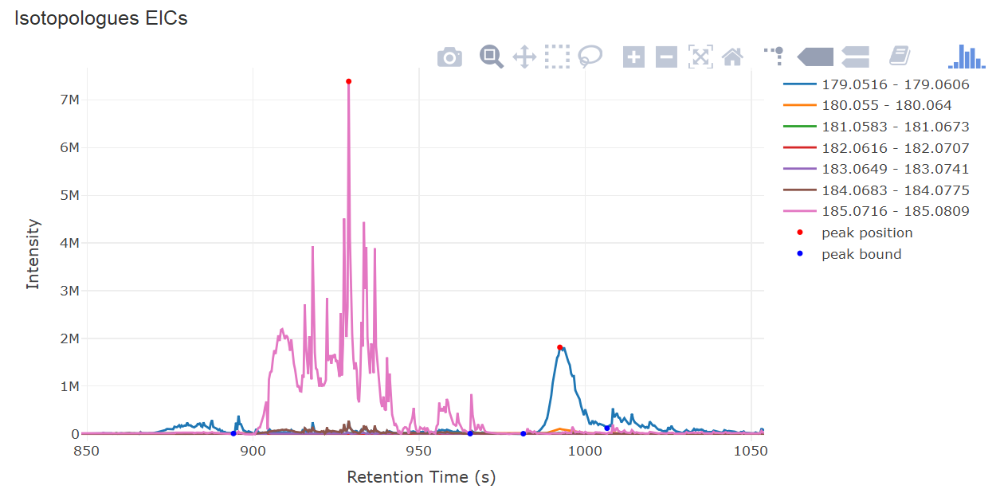


## Save the results
In the quantitative analysis tab page, the results will be shown automatically.
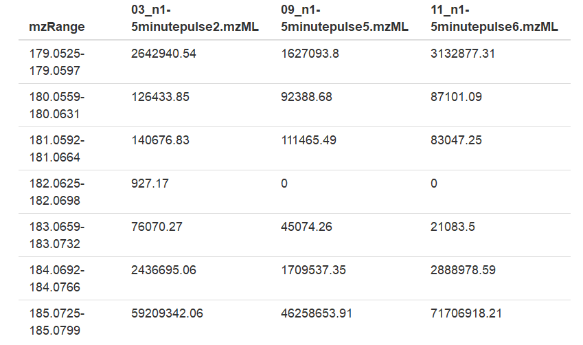
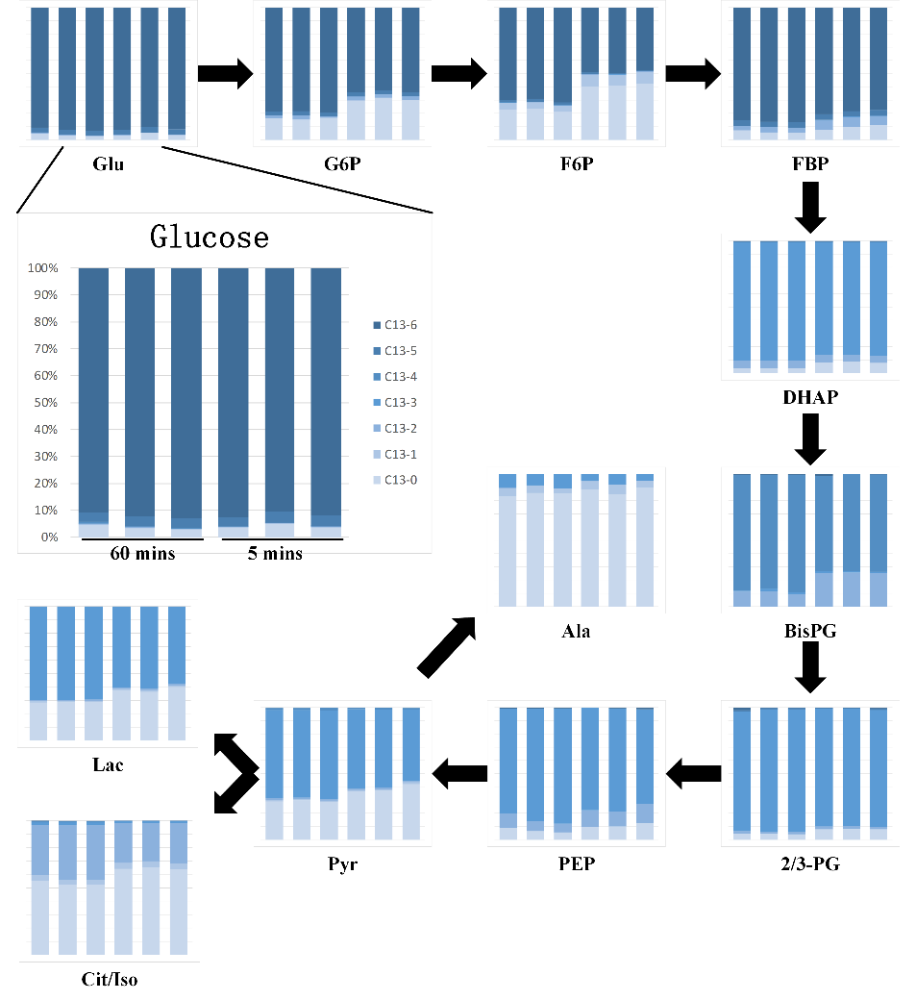